```mermaid

flowchart LR
    subgraph Preparation
        A[Clean Workspace]
        A --> B[Checkout Code]
        B --> C[SonarQube Analysis]
    end

    subgraph Build
        C --> D[Quality Gate Check]
        D --> E[Build Docker Image]
        E --> F[Trivy Vulnerability Scan]
    end

    subgraph Deployment
        F --> G[Push to Docker Hub]
        G --> H[Manual Approval]
        H --> I[Remote Deployment]
        I --> J[Stop Existing Container]
        J --> K[Deploy New Container]
        K --> L[Send Email Notification]
    end

    %% Link Subgraphs
    Preparation --> Build --> Deployment

```

# JuristBot Jenkins CI/CD Pipeline 🗜️

This repository documents the **Jenkins CI/CD pipeline configuration** for **JuristBot AI**. The pipeline automates the build, test, security scan, and deployment processes with robust DevOps practices.

---

## 🌟 **Pipeline Overview**

The Jenkins pipeline ensures seamless CI/CD automation for the **JuristBot AI** project by integrating various DevOps tools. It covers the following stages:
1. **Code Checkout**: Pulls the latest source code from the GitHub repository.
2. **Code Quality Analysis**:  
    - Integrates with **SonarQube** for static code analysis.  
    - Implements **Quality Gates** to enforce coding standards.
3. **Docker Image Build**: Builds the application into a Docker image.
4. **Security Scan**:  
   - Uses **Trivy** to identify HIGH/CRITICAL vulnerabilities in the Docker image.
   - **Manual Decision** Prompts the user to decide whether to proceed or abort deployment based on the scan results.
5. **Push to Docker Hub**: Pushes the Docker image to the Docker Hub repository.
6. **Approval Stage**: Manual approval from **"Product Manager"** before proceeding with deployment.
7. **Remote Deployment**:  
   - Pulls the latest Docker image on a remote server.  
   - Stops the existing container and starts the updated version.
8. **Email Notifications**: Sends deployment status and logs to stakeholders.

---

## 🛠️ **Pipeline Configuration**

### **Tools & Integrations**
| **Tool**           | **Purpose**                                                   |
|---------------------|--------------------------------------------------------------|
| **GitHub**         | Version control and source code repository.                  |
| **Jenkins**        | CI/CD pipeline automation.                                   |
| **SonarQube**      | Static code analysis and quality gate enforcement.           |
| **Docker**         | Containerization of the application.                         |
| **Trivy**          | Security vulnerability scanning for Docker images.           |      
| **Approval**       | Requires manual approval from Product Manager            |       
| **SSH**            | Secure deployment to a remote server.                        |
| **Email**          | Automated build and deployment notifications.                |

### **Pipeline Stages**

1. **Clean Workspace**
   - Cleans the Jenkins workspace before starting the pipeline.

2. **Checkout Code**
   - Pulls the latest code from the `main` branch in GitHub.

3. **SonarQube Analysis**
   - Runs static code analysis using SonarQube to identify bugs, vulnerabilities, and code smells.

4. **Quality Gate**
   - Polls SonarQube for the quality gate status and fails the pipeline if the gate is not met.

5. **Docker Build**
   - Builds a Docker image of the JuristBot application and tags it with the build number and `latest`.

6. **Trivy Vulnerability Scan**
   - Scans the Docker image for **HIGH** and **CRITICAL** vulnerabilities using Trivy.
   - If vulnerabilities are found, manual intervention is required to proceed.

7. **Push Docker Image to Docker Hub**
   - Pushes the Docker image to the **Docker Hub** repository.

8. **Manual Approval**
   - Requests manual approval from **"Product Manager"** before proceeding to deployment.

9. **Pull & Deploy Docker Image on Remote Server**
   - Stops any existing containers and runs the new Docker image on a remote server via SSH.

10. **Email Notification**
    - Sends an email with deployment status, logs, and relevant details to the team.

---

## ⚙️ **Pipeline Stages Explained**

### **Jenkinsfile**
The complete Jenkins pipeline is defined in the `Jenkinsfile` using a Declarative Pipeline.

<details>
<summary>Click to expand Jenkinsfile</summary>

### **1. Clean Workspace**
```groovy
cleanWs()
```

### **2. Checkout Code**
**Fetches the latest code from the GitHub repository:**
```groovy
checkout([$class: 'GitSCM',
          branches: [[name: 'main']],
          userRemoteConfigs: [[url: 'https://github.com/Dummy/JuristBot-AI.git',
                               credentialsId: 'GitHub-Token']]
])
```

### **3. SonarQube Analysis**
**Performs static code analysis and enforces quality gates:**
```groovy
withSonarQubeEnv('Sonar-Server') {
    sh '''
    /opt/sonar-scanner/bin/sonar-scanner \
    -Dsonar.projectKey=Juristbot-AI \
    -Dsonar.sources=. \
    -Dsonar.host.url=${SONARQUBE_URL} \
    -Dsonar.token=${SONAR_TOKEN}
    '''
}
```

### **4. Quality Gate Check**
**Polls the SonarQube server for the Quality Gate result:**
```groovy
def response = sh(script: "curl -s -u ${SONAR_TOKEN}: '${sonarHostUrl}/api/qualitygates/project_status?projectKey=${sonarProjectKey}'", returnStdout: true)
```

### **5. Build Docker Image**
**Builds and tags the Docker image:**
```groovy
sh "docker build -t ${DOCKER_IMAGE}:${env.BUILD_NUMBER} ."
sh "docker tag ${DOCKER_IMAGE}:${env.BUILD_NUMBER} ${DOCKER_IMAGE}:latest"
```

### **6. Trivy Vulnerability Scan**
**Scans the Docker image for vulnerabilities:**
```groovy
sh "trivy image --exit-code 1 --severity HIGH,CRITICAL ${DOCKER_IMAGE}:${imageTag}"
```

### **7. Push Docker Image**
**Pushes the Docker image to Docker Hub:**
```groovy
docker login -u "${DOCKER_USER}" --password-stdin
docker push ${DOCKER_IMAGE}:${imageTag}
docker push ${DOCKER_IMAGE}:latest
```

### **8. Manual Approval**
**Requires manual approval from "Product Manager":**
```groovy
def userInput = input(
    message: 'Do you want to proceed with this Deployment?',
    submitterParameter: 'APPROVER',
    ok: 'Yes'
)
```

### **9. Remote Deployment**
**Deploys the Docker image to a remote server:**
```groovy
sshpass -p '${SSH_PASSWORD}' ssh ${SSH_USER}@${REMOTE_SERVER_IP} "docker pull ${DOCKER_IMAGE}:latest"
```

### **10. Notifications**
**Sends deployment emails to stakeholders with logs:**
```groovy
emailext(
    to: 'team@neuronestai.in',
    subject: 'Deployment Successful',
    body: 'JuristBot AI has been successfully deployed.',
    attachLog: true
)
```
</details>

---

## 📊 Jenkins Pipeline Diagram


## 🎓 **Key Features**

1. **Automated CI/CD Workflow:** Streamlines build, test, and deployment processes.
2. **Secure Deployments:** Vulnerability checks with Trivy.
3. **Code Quality:** Enforced with SonarQube.
4. **Manual Approval:** Ensures controlled deployments to production.
5. **Automated Notifications:** Keeps the team informed with detailed logs.

---

## 🏆 **Conclusion**
#### This Jenkins pipeline demonstrates a robust, secure, and scalable deployment strategy for JuristBot AI, showcasing best practices in DevOps, security, and continuous delivery.


