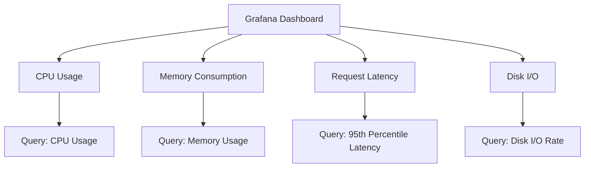

# Prometheus & Grafana Configuration for JuristBot AI 🚨

This document details the **Prometheus and Grafana** setup for monitoring and alerting in the **JuristBot AI** project. These tools ensure that the application’s performance, availability, and reliability are continuously monitored.

---

## 🔍 **What is Prometheus?**

**Prometheus** is an open-source monitoring system designed for high reliability and scalability. It collects metrics from configured targets at regular intervals, stores them, and provides a powerful query language for analysis.

---

## 🎯 **Use Case in JuristBot AI**

In the **JuristBot AI** project, Prometheus is used to:
1. **Monitor Application Health**: Tracks metrics like CPU usage, memory consumption, and request latency.
2. **Alert on Failures**: Generates alerts for failures or threshold breaches (e.g., high latency, server downtime).
3. **Provide Metrics for Analysis**: Supplies detailed metrics for long-term performance optimization.
4. **Integrate with Grafana**: Visualizes metrics in user-friendly dashboards.

---

## 📦 **What is Node Exporter?**

**Node Exporter** is a Prometheus exporter for hardware and operating system metrics. It runs as a lightweight process on the server and provides detailed insights into the machine's health.

### **Metrics Collected by Node Exporter**
1. **CPU Usage**: Tracks CPU load and idle time.
2. **Memory Usage**: Monitors used, free, and cached memory.
3. **Disk Usage**: Reports available and used disk space.
4. **Network Statistics**: Tracks bytes sent/received and packet errors.
---

## 📦 **What is cAdvisor?**
**cAdvisor (Container Advisor) provides resource usage and performance metrics for Docker containers. It is a lightweight tool developed by Google and integrates seamlessly with Prometheus.**

### **Metrics Collected by cAdvisor**
1. **CPU and Memory Usage:** Tracks resource utilization by each container.
2. **Disk I/O:** Monitors read/write operations.
3. **Network Usage:** Tracks network traffic for each container.
4. **Container Metadata:** Provides information about container labels, IDs, and uptime.

---
## ⚙️ **How Prometheus Works**

1. **Data Collection**:
   - Prometheus scrapes metrics from targets (e.g., application endpoints, servers) using HTTP endpoints.
   - Targets expose metrics in a **key-value pair** format using the `/metrics` endpoint.

2. **Data Storage**:
   - Metrics are stored in a time-series database (TSDB) optimized for queries over time.

3. **Querying**:
   - PromQL (Prometheus Query Language) is used to extract and aggregate data for analysis.

4. **Alerts**:
   - Prometheus generates alerts based on defined conditions.
   - Alerts are sent to external services like **Slack**, **PagerDuty**, or **email**.

---

## 🔔 **How Prometheus Alerts Work**

Prometheus uses an **Alertmanager** to handle alerts:
1. **Alert Rules**:
   - Define conditions under which alerts are triggered.
   - Example: Notify if CPU usage exceeds 90% for more than 5 minutes.
   
2. **Alert Notifications**:
   - Sends alerts to configured endpoints such as email, Slack, or other third-party services.
   
3. **Failure Alerts**:
   - Example failure situations:
     - Application downtime.
     - High memory or CPU usage.
     - Increased response latency.
---

## 📊 **Why is Monitoring Important in Production?**

1. Proactive Issue Detection:
   * Identifies potential issues (e.g., resource saturation) before they impact users.
2. Reduced Downtime:
   * Real-time alerts allow teams to respond quickly to failures.
3. Performance Optimization:
   * Insights into resource usage enable better capacity planning.
4. Compliance and Reporting:
   * Tracks performance against SLAs (Service Level Agreements).
---
## 📈 **What is Grafana?**
**Grafana is an open-source analytics and visualization tool. It integrates seamlessly with Prometheus to create interactive dashboards for real-time metrics visualization.**

---

## 📊 **Example Dashboard Metrics**

---

## 🌟 **Benefits of Prometheus & Grafana in JuristBot AI**
1. Real-Time Monitoring:
   * Monitors resource usage, application performance, and system health.
2. Custom Alerts:
   * Notifies the team of critical issues before they escalate.
3. Interactive Dashboards:
   * Grafana visualizes metrics, enabling quick troubleshooting.
4. Scalability:
   * Handles monitoring across multiple services and environments.
5. Cost-Efficient:
   * Open-source and highly extensible.
---

## 🏁 **Conclusion**
****By integrating Prometheus and Grafana, the JuristBot AI project ensures robust monitoring and alerting capabilities. These tools provide actionable insights, enabling faster responses to failures and improved application performance.****