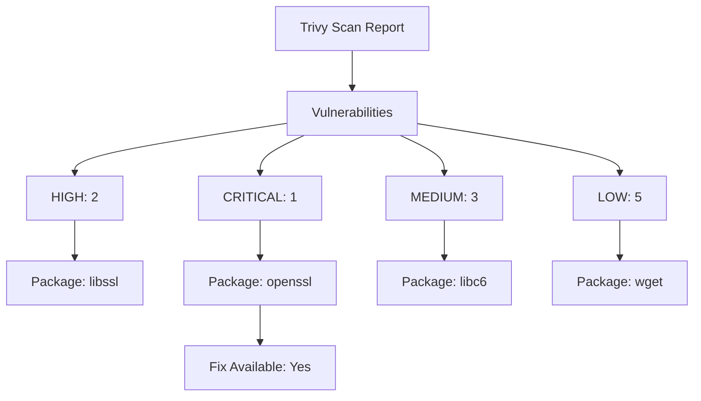

# Trivy Configuration for JuristBot AI ☢️🔍

This document explains the configuration and usage of **Trivy**, a vulnerability scanner for Docker images, in the **JuristBot AI** project. Trivy is an essential tool in our DevOps pipeline to ensure security and compliance by identifying vulnerabilities early.

---

## 🔍 **What is Trivy?**

**Trivy** is a vulnerability scanner for containers and other artifacts, including:
- Docker images
- Filesystems
- Git repositories
- Kubernetes resources

Trivy scans for vulnerabilities in operating system packages and application dependencies, providing detailed insights into the risks associated with each component.

---

## 🎯 **Use Case in JuristBot AI**

In the **JuristBot AI** project, Trivy is used to:
1. **Scan Docker Images**: Identify vulnerabilities before deploying to production.
2. **Security Assurance**: Ensure the deployed images are free of HIGH and CRITICAL vulnerabilities.
3. **Automated Pipeline Integration**: Integrated into the CI/CD pipeline to automate scans for every new build.
4. **Compliance**: Maintain compliance by generating vulnerability reports.

---

## 🛠️ **How Trivy Scans Docker Images**

Trivy scans Docker images by:
1. **Pulling Image Metadata**: Extracts package and dependency information from the image.
2. **Vulnerability Database**: Compares the extracted metadata against its vulnerability database, which is regularly updated.
3. **Risk Classification**: Reports vulnerabilities categorized as LOW, MEDIUM, HIGH, and CRITICAL.

---

## 🖥️ **Trivy Commands**

Here are is the some example key commands to use Trivy for scanning Docker images:
<details>
<summary>Click to expand</summary>

**1. Scan a Local Docker Image**
```bash
trivy image <image_name>
```
**2. Scan a Remote Docker Image**
```bash
trivy image neuronestai/juristbot:latest
```
**3. Scan with Severity Filter**
```bash
trivy image --severity HIGH,CRITICAL <image_name>
```
**4. Output Report in JSON Format**
```bash
trivy image -f json -o report.json <image_name>
```
**5. Exclude Unfixed Vulnerabilities**
```bash
trivy image --ignore-unfixed <image_name>
```
</details>
---

## 📊 **Trivy Example Report**

The following is a sample Trivy scan result for the Docker image


---
## 🛡️ **Benefits of Trivy in JuristBot AI**
1. Enhanced Security:
    * Proactively detects vulnerabilities in Docker images.
    * Reduces the risk of deploying insecure images.
2. Automated Scanning:
    * Ensures every image is scanned as part of the CI/CD pipeline.
    * Saves time and effort compared to manual reviews.
3. Compliance and Reporting:
    * Maintains compliance with industry security standards.
    * Generates detailed reports for audits.
4. Customizable Scans:
    * Filters by severity to focus on HIGH and CRITICAL vulnerabilities.
---

## 🧩 **Conclusion**
****By integrating Trivy into the JuristBot AI project, we ensure that only secure Docker images are deployed to production. Its seamless CI/CD integration, detailed reports, and vulnerability filtering make it an invaluable tool for maintaining security and compliance.****