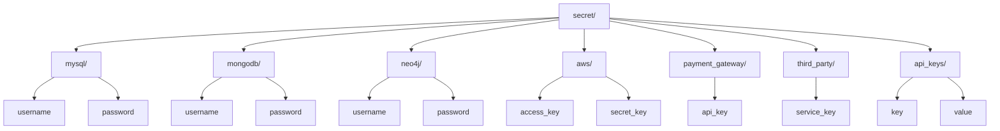
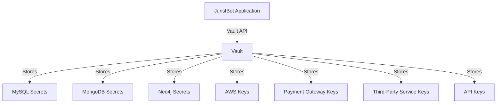

# Vault Configuration for JuristBot AI 🛅

This document outlines the configuration and usage of **Vault** for securely managing sensitive credentials and keys in the **JuristBot AI** project. By using Vault, we ensure that all sensitive data is stored securely and accessed only by authorized services.

---

## 🔒 **What is Vault?**

**Vault** by HashiCorp is a tool for securely accessing secrets such as API keys, database credentials, and other sensitive information. It provides mechanisms to:
1. **Store Secrets**: Encrypt sensitive information at rest.
2. **Dynamic Secrets**: Generate secrets on demand with a lease and expiration.
3. **Access Control**: Use policies to control who and what can access specific secrets.
4. **Audit Logging**: Track access and usage of secrets for security and compliance.

---

## 🎯 **Use Case in JuristBot AI**

In the **JuristBot AI** project, Vault is used to securely store and manage the following sensitive credentials:
1. **MySQL Login**: Database credentials for structured data storage.
2. **MongoDB Login**: NoSQL database credentials for flexible data storage.
3. **Neo4j DB Login**: Graph database credentials for managing relationships between entities.
4. **AWS Keys**: Access keys for managing AWS resources like EC2, S3, and RDS.
5. **Payment Gateway Keys**: Credentials for secure payment processing.
6. **Third-Party Service Keys**: Integration keys for external services.
7. **API Keys**: Credentials for internal and external API communication.

## 🛠️ **Vault Secrets Structure**

The secrets for **JuristBot AI** are organized logically within Vault as shown below:


---

## 🛠️ **How Vault Works**

### **1. Storing Secrets**
Vault securely stores secrets by encrypting them using **AES-256** encryption. Secrets are stored as key-value pairs in a logical structure known as **paths**.

### **2. Accessing Secrets**
Secrets can be accessed programmatically via:
- **Vault CLI**: Directly interact with Vault.
- **Vault API**: Integrate secrets into applications dynamically.
- **Environment Variables**: Inject secrets into the environment for runtime use.

### **3. Policies and Access Control**
Vault uses **policies** to define who can access specific secrets. Policies can grant read, write, or delete permissions.

Example Policy:

<details>
<summary>Click to expand</summary>

```hcl
path "secret/mysql/*" {
  capabilities = ["read", "write"]
}

path "secret/aws/*" {
  capabilities = ["read", "list"]
}
```
</details>

### **4. Environment Variables for Vault**
```bash
export VAULT_ADDR=http://127.0.0.1:8200
export VAULT_TOKEN=your-token
```
---

## 🛡️ **Security Features**
* Encryption: Secrets are encrypted using AES-256.
* Access Control: Policies define who can access specific secrets.
* Audit Logs: Tracks all interactions with Vault for accountability.
* Dynamic Secrets: Auto-expiring credentials minimize the attack surface
---
## 📊 **Architecture Overview**

---

## 🎯 **Benefits for JuristBot AI**
1. Centralized Secrets Management:

    * All sensitive keys are securely stored in one place.
    * Avoids hardcoding secrets in codebases or configuration files.
2. Enhanced Security:

    * Secrets are encrypted at rest and accessed securely.
    * Limits access with granular policies.
3. Dynamic Secrets:

    * Generate temporary credentials to minimize exposure.
4. Compliance:

    * Logs every interaction with secrets for auditing purposes.
---

## 🧩 **Conclusion**
***Vault plays a crucial role in the JuristBot AI project by providing a secure, centralized solution for managing sensitive credentials. Its integration ensures security, compliance, and scalability for the project.***